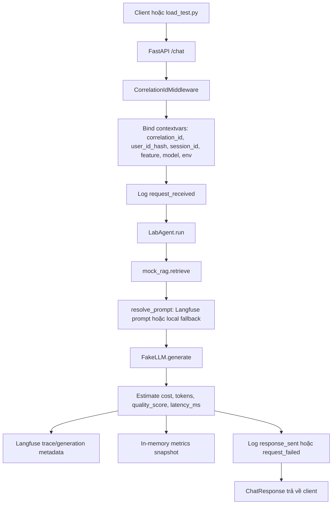
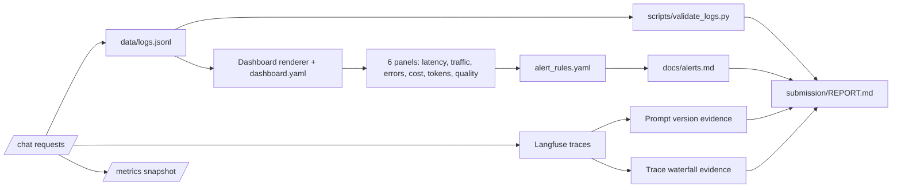
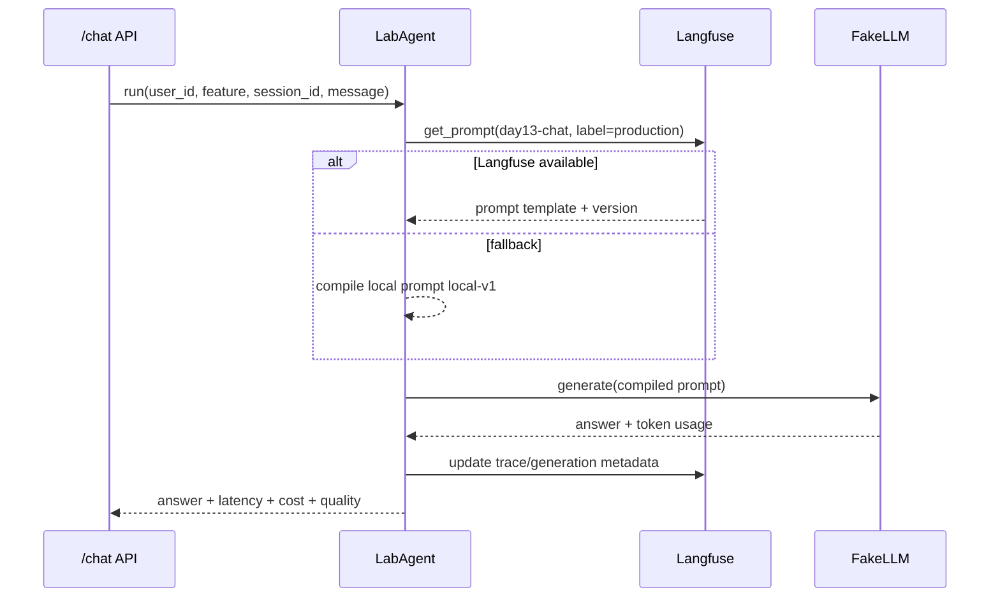
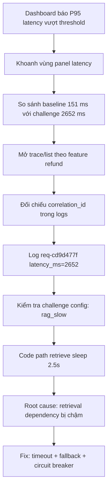

# Báo cáo Day 13 - Observability cho hệ thống AI

## 1. Thông tin nhóm

- Tên nhóm: `DAY13_2A202601273_HOANGSYTOAN`
- Repository URL: `https://github.com/HoangToan-nobi/DAY13_2A202601273_HOANGSYTOAN`
- Commit SHA cuối: `a3108839107e2a891bfd371a1f382fd69a1e40df`
- Thành viên và vai trò:
  - `Hoàng Sỹ Toàn - 2A202601273` - Logging & PII
  - `Nguyễn Phương Linh - 2A202601355` - Tracing & Prompt Version
  - `Đỗ Thái Dương - 2A202601337` - Dashboard, Incident & Report

## 2. Dự án là gì?

Dự án là một AI chat service dạng lab, được xây bằng FastAPI. API chính là `/chat`: người dùng gửi `user_id`, `session_id`, `feature` và `message`; hệ thống gọi một RAG retriever giả lập, dựng prompt, gọi fake LLM, rồi trả về câu trả lời cùng các chỉ số vận hành như latency, token, cost và quality score.

Mục tiêu của bài không phải tạo chatbot phức tạp, mà là biến một AI service khó quan sát thành hệ thống có thể debug bằng bằng chứng. Nhóm đã bổ sung observability theo ba lớp:

- Logs: JSON log có cấu trúc, correlation ID xuyên suốt request, context enrichment và PII redaction.
- Traces: trace/generation metadata trên Langfuse, gắn prompt name/label/version và correlation ID.
- Metrics/Dashboard: latency, traffic, error rate, cost, token và quality proxy; có SLO, alert rule và runbook.

## 3. Phạm vi nhóm đã triển khai

Nhóm hoàn thiện các phần chính trong `app/`, `config/`, `scripts/`, `tests/` và `submission/`:

| Mảng | File liên quan | Nhóm đã làm |
|---|---|---|
| API workflow | `app/main.py`, `app/agent.py` | Chuẩn hóa request flow, log event đầu/cuối request, ghi latency/token/cost/quality. |
| Logging | `app/logging_config.py`, `app/middleware.py` | Ghi JSONL vào `data/logs.jsonl`, propagate `correlation_id`, bind context vào mọi log trong request. |
| PII protection | `app/pii.py` | Hash `user_id`, scrub email/card/phone và chỉ lưu preview đã sanitize. |
| Tracing | `app/tracing.py`, `app/agent.py` | Tích hợp Langfuse, cập nhật trace/generation metadata, fallback an toàn khi không có key. |
| Prompt versioning | `app/prompt_management.py`, `docs/PROMPT_VERSIONING.md` | Hỗ trợ prompt `day13-chat`, label `production`, version từ Langfuse hoặc local fallback. |
| Dashboard & SLO | `config/dashboard.yaml`, `config/slo.yaml`, `docs/alerts.md` | Thiết kế 6 panel, threshold, SLO 28 ngày, alert symptom-based và runbook. |
| Incident investigation | `config/challenge.json`, `submission/evidence/challenge-investigation.txt` | Điều tra challenge `rag_slow` bằng Metrics -> Traces -> Logs. |

## 4. Workflow hệ thống

Luồng trên thể hiện điểm quan trọng của bài: mỗi request có cùng một `correlation_id` trong log, trace metadata và response. Khi có sự cố, nhóm có thể đi từ dashboard metric đến trace, rồi dùng log line cụ thể để chứng minh nguyên nhân.

## 5. Observability pipeline

Nguồn dashboard chính là `data/logs.jsonl`, không phụ thuộc vào Langfuse. Langfuse được dùng cho trace waterfall và prompt versioning; dashboard local dùng log để tính metric và render bằng chứng.

## 6. Kết quả kỹ thuật và bằng chứng

- Test suite: `35 passed, 2 warnings in 6.32s` theo [validation-results.txt](evidence/validation-results.txt).
- Điểm `validate_logs.py`: `100/100`.
- Log records được kiểm tra: `44`.
- Records thiếu required fields: `0`.
- Records thiếu enrichment/context: `0`.
- Unique correlation IDs: `23`.
- PII leak còn lại: `0`.
- Dashboard validator: `HỢP LỆ: 6/6 panel có trong dashboard contract.`
- Tổng số traces: `50` traces hợp lệ đã có trên Langfuse. 10 Trace ID ví dụ: `923ff7aa26da...`, `e91305c2d4d8...`, `a494ddd163c7...`, `691d58d20442...`, `dcf02d843fc0...`, `72219bc3252c...`, `1faf3af4c3ee...`, `fefad95d154c...`, `c1e28d7aaeac...`, `492fe03945d2...`.
- Evidence dashboard: [dashboard-runtime.svg](evidence/dashboard-runtime.svg).
- Evidence trace waterfall: [trace-waterfall.png](evidence/trace-waterfall.png).
- Evidence trace list: [trace-list.png](evidence/trace-list.png).
- Evidence challenge: [challenge-investigation.txt](evidence/challenge-investigation.txt).

## 7. Logging và PII redaction

Nhóm triển khai structured logging bằng `structlog`. Mỗi request sinh các event quan trọng:

- `request_received`: ghi nhận request đã vào API, có `correlation_id`, `session_id`, `feature`, `model`, `env`, `user_id_hash` và `message_preview` đã sanitize.
- `response_sent`: ghi nhận request thành công, có `latency_ms`, `tokens_in`, `tokens_out`, `cost_usd`, `quality_score` và `answer_preview`.
- `request_failed`: ghi nhận lỗi, có `error_type`, latency đến thời điểm lỗi và payload đã scrub.

PII được xử lý trước khi log đi vào sink:

- `user_id` không ghi thẳng, chỉ ghi `user_id_hash`.
- Payload dạng text chỉ lưu preview đã sanitize.
- Processor `scrub_event` chạy trước file renderer và console renderer.
- Các key hệ thống an toàn như `ts`, `level`, `service`, `env`, `model`, `correlation_id`, `user_id_hash` được giữ nguyên để phục vụ debug.

Bằng chứng: [validation-results.txt](evidence/validation-results.txt) cho thấy validator phát hiện `0` PII leak; kiểm tra email/test card cũng không còn hit.

## 8. Tracing và prompt versioning

Trace được tạo ở lớp `LabAgent.run` bằng Langfuse `observe`. Nhóm cập nhật metadata cho trace/generation gồm:

- `user_id`: dùng hash thay vì raw user ID.
- `session_id`, `tags`: giúp lọc theo feature/model.
- `correlation_id`: nối trace với log.
- `prompt_name`, `prompt_label`, `prompt_version`, `prompt_source`: chứng minh request dùng prompt nào.
- Usage/cost metadata: input token, output token và estimated total cost.

Prompt versioning dùng prompt name `day13-chat`. Label chính là `production`; nhóm tạo baseline `v1`, candidate `v2`, chạy cùng input để sinh trace theo từng version và có bằng chứng rollback/đổi label.

- Trace version 1: xem [prompt-v1.png](evidence/prompt-v1.png).
- Trace version 2: xem [prompt-v2.png](evidence/prompt-v2.png).
- Bằng chứng rollback/label: [prompt-rollback.jpeg](evidence/prompt-rollback.jpeg).

## 9. Dashboard, SLO và alerts

Dashboard contract nằm ở [../config/dashboard.yaml](../config/dashboard.yaml), gồm 6 panel bắt buộc:

| Panel | Ý nghĩa | Threshold |
|---|---|---|
| Latency percentiles | P50/P95/P99 latency từ `response_sent.latency_ms` | P95 <= 3000 ms |
| Request traffic | Count/rate request theo phút từ `request_received` | >= 1 request/min |
| Error rate and breakdown | Tỷ lệ lỗi và breakdown `error_type` | <= 2% |
| Cost over time | Tổng cost theo thời gian | <= 2.5 USD |
| Input and output tokens | Tổng token vào/ra | <= 50000 tokens |
| Quality proxy | Trung bình `quality_score` | >= 0.75 |

SLO trong [../config/slo.yaml](../config/slo.yaml):

- P95 latency <= `3000 ms`, target `99.5%`.
- Error rate <= `2%`, target `99.0%`.
- Daily cost <= `2.5 USD`, target `100%`.
- Average quality score >= `0.75`, target `95%`.

Lý do chọn ngưỡng: latency bảo vệ trải nghiệm người dùng, error rate bảo vệ độ tin cậy, cost bảo vệ ngân sách, quality proxy bảo vệ chất lượng câu trả lời. Alert rules trong [../config/alert_rules.yaml](../config/alert_rules.yaml) và runbook trong [../docs/alerts.md](../docs/alerts.md) được thiết kế theo triệu chứng trước, rồi mới đi tìm root cause.

## 10. Điều tra challenge

Challenge chính thức:

- Challenge ID: `day13-k3-observability-v1`.
- Incident được bật: `rag_slow`.
- Feature bị ảnh hưởng: `refund`.
- Threshold challenge: `2000 ms`.

Triệu chứng từ metrics:

- Baseline 10 requests: latency P50/P95/P99 = `151/151/151 ms`.
- Sau challenge 15 cumulative requests: latency P50/P95/P99 = `151/2652/2652 ms`.
- P95 tăng `2501 ms`, khoảng `17.56x`, vượt threshold `2000 ms`.
- Cost tăng nhẹ theo số request, quality gần baseline, error không phải triệu chứng chính.

Root cause:

`config/challenge.json` bật incident `rag_slow`. Khi incident này active, `app/mock_rag.py` làm `retrieve()` sleep `2.5` giây. Log của 5 request official challenge đều có `response_sent.latency_ms` khoảng `2651-2652 ms`, khớp với delay nhân tạo này. Vì cost, token, error và quality không biến động bất thường tương ứng, nguyên nhân được cô lập ở retrieval latency.

Bằng chứng log đại diện:

- Correlation ID: `req-cd9d477f`.
- `request_received`: `feature=refund`, `session_id=k3-challenge-s03`.
- `response_sent`: `latency_ms=2652`, `cost_usd=0.002382`, `tokens_in=34`, `tokens_out=152`, `quality_score=0.8`.

Fix action đề xuất:

- Tắt dependency/incident path đang gây chậm.
- Áp timeout nghiêm ngặt cho retrieval.
- Trả fallback an toàn khi retrieval vượt latency budget.
- Thêm circuit breaker cho dependency RAG.

Preventive measure:

- Thêm child span riêng cho retrieval và generation để waterfall chỉ rõ phần chậm.
- Ghi dependency latency metric.
- Alert khi P95 vượt `3000 ms` trong nhiều cửa sổ liên tiếp.
- Thêm test timeout/fallback cho `retrieve()`.
- Chạy lại workload giống challenge sau khi fix để xác nhận latency hồi phục.

## 11. Verification checklist

| Hạng mục | Kết quả | Evidence |
|---|---:|---|
| Unit/public tests | `35 passed` | [validation-results.txt](evidence/validation-results.txt) |
| Log validator | `100/100` | [validation-results.txt](evidence/validation-results.txt) |
| Missing required fields | `0` | [validation-results.txt](evidence/validation-results.txt) |
| PII leaks | `0` | [validation-results.txt](evidence/validation-results.txt) |
| Dashboard panels | `6/6` | [validation-results.txt](evidence/validation-results.txt), [dashboard-runtime.svg](evidence/dashboard-runtime.svg) |
| Traces | `50` traces | [trace-list.png](evidence/trace-list.png) |
| Trace waterfall | Có | [trace-waterfall.png](evidence/trace-waterfall.png) |
| Prompt v1/v2 | Có | [prompt-v1.png](evidence/prompt-v1.png), [prompt-v2.png](evidence/prompt-v2.png) |
| Prompt rollback/label | Có | [prompt-rollback.jpeg](evidence/prompt-rollback.jpeg) |
| Challenge investigation | Có root cause/fix/prevention | [challenge-investigation.txt](evidence/challenge-investigation.txt) |

## 12. Đóng góp cá nhân

| Thành viên | Phần việc | Commit/PR | Điều đã học |
|---|---|---|---|
| `Hoàng Sỹ Toàn` | Correlation ID, JSON logging, metadata và PII redaction | `e931dc3` | Bảo toàn context request và scrub PII trước khi ghi log. |
| `Nguyễn Phương Linh` | Trace correlation metadata và test liên quan | `f06f615` | Liên kết correlation ID giữa log và trace, đồng thời gắn metadata prompt vào trace. |
| `Đỗ Thái Dương` | Dashboard contract/spec, SLO, alerts, runbook, incident và tổng hợp report | `97cc025` | Thiết kế alert theo triệu chứng và điều tra theo Metrics -> Traces -> Logs. |

## 13. Kết luận

Sau khi hoàn thiện bài lab, service `/chat` không chỉ trả lời được request mà còn có khả năng tự giải thích trạng thái vận hành. Khi có incident, nhóm có thể bắt đầu từ dashboard, xác định metric bất thường, mở trace/prompt metadata, rồi dùng log theo `correlation_id` để chứng minh root cause. Kết quả validation hiện tại đạt yêu cầu kỹ thuật chính: tests pass, log validator đạt `100/100`, dashboard đủ `6/6` panel và không phát hiện PII leak.
